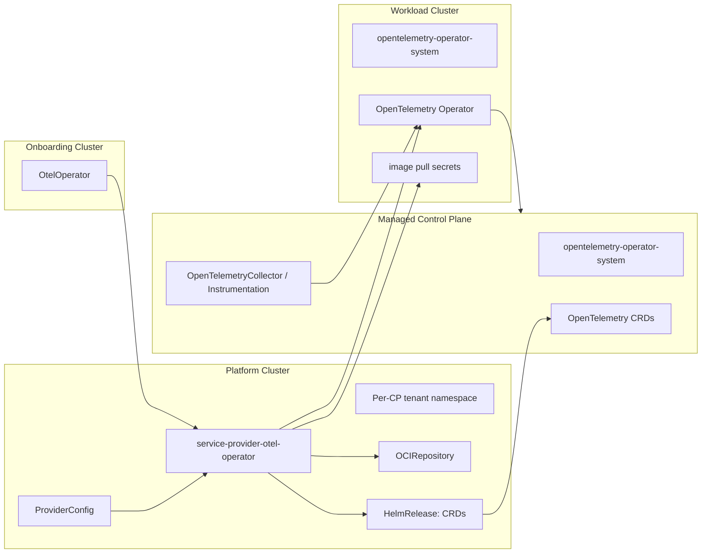

[](https://api.reuse.software/info/github.com/openmcp-project/service-provider-otel-operator)

# 🚀 Service Provider: OTEL Operator

An [OpenMCP](https://github.com/openmcp-project) Service Provider that automates deployment and lifecycle management of the [OpenTelemetry Operator](https://github.com/open-telemetry/opentelemetry-operator) into Managed Control Planes via Helm.

The provider installs the official [`opentelemetry-kube-stack` Helm chart](https://github.com/open-telemetry/opentelemetry-helm-charts/tree/main/charts/opentelemetry-kube-stack) as two managed Flux releases:

- a **CRD-only release** in the Control Plane (CP), so users can create OpenTelemetry resources there
- an **operator-only release** in the workload cluster, configured to watch the CP API

## 📖 Overview

This service provider installs one OpenTelemetry Operator per `OtelOperator` service instance. Once the operator is ready, users can create `OpenTelemetryCollector` and `Instrumentation` resources in the CP to configure telemetry collection.

### Architecture



### Reconciliation Flow

1. Set the `OtelOperator` status to `Progressing`.
2. Prepare CP ServiceAccount authentication for the workload operator.
3. Copy configured image pull secrets from the provider pod namespace to the workload cluster.
4. Create or update one `opentelemetry-kube-stack` `OCIRepository`.
5. Install or upgrade the CP CRD-only `HelmRelease` (`<name>-crds`).
6. Install or upgrade the workload operator-only `HelmRelease` (`<name>-workload`).
7. Report managed resource status and set the service instance to `Ready` when all managed resources are ready.

### Deletion Behaviour

On deletion, the provider first checks whether user-owned OpenTelemetry resources still exist in the CP. Deletion is blocked while any of these resources exist:

- `OpenTelemetryCollector` (`opentelemetry.io/v1alpha1` or `opentelemetry.io/v1beta1`)
- `Instrumentation` (`opentelemetry.io/v1alpha1`)

While blocked, the `OtelOperator` is set to phase `Terminating` with reason `UserResourcesExist`. Delete the remaining user resources first, then reconciliation continues.

After the block is cleared, the service provider deletes its managed Flux/authentication resources. The CRD Helm release uses orphan deletion propagation, so the OpenTelemetry CRDs and existing CP custom resources are not garbage-collected with the HelmRelease.

## 🚦 Getting Started

### Prerequisites

- Go 1.26.6+ for local development
- [Task](https://taskfile.dev/) as task runner
- Docker for image builds and e2e tests
- Access to an OpenMCP environment
- On macOS: GNU `realpath` for e2e tests (`brew install coreutils`)

### Installation

Install the service provider by creating a `ServiceProvider` resource in the platform cluster. Use the image tag that matches the release you want to deploy.

```yaml
apiVersion: openmcp.cloud/v1alpha1
kind: ServiceProvider
metadata:
  name: otel-operator
  namespace: openmcp-system
spec:
  image: ghcr.io/openmcp-project/images/service-provider-otel-operator:<version>
```

The OpenMCP runtime starts the provider with the `init` command to register CRDs/GVKs, then with the `run` command to reconcile instances.

For manual/local debugging, the binary expects the command as first argument:

```bash
# Install/update service provider CRDs and register the provided GVK.
POD_NAMESPACE=openmcp-system \
  service-provider-otel-operator init \
  --provider-name otel-operator

# Start the controller.
POD_NAMESPACE=openmcp-system \
  service-provider-otel-operator run \
  --provider-name otel-operator
```

`POD_NAMESPACE` is required. It tells the provider where to read configured registry/image-pull secrets from.

## 📝 API Reference

### OtelOperator

`OtelOperator` is created in the onboarding cluster per CP to request an OpenTelemetry Operator installation.

```yaml
apiVersion: oteloperator.services.openmcp.cloud/v1alpha1
kind: OtelOperator
metadata:
  name: my-cp
spec:
  # Required: opentelemetry-kube-stack Helm chart version.
  version: "0.20.1"
```

| Field          | Type   | Required | Description |
| -------------- | ------ | :------: | ----------- |
| `spec.version` | string |    yes   | `opentelemetry-kube-stack` Helm chart version to install. |

### ProviderConfig

`ProviderConfig` is a cluster-scoped resource in the platform cluster. It configures defaults shared by all `OtelOperator` instances.

```yaml
apiVersion: oteloperator.services.openmcp.cloud/v1alpha1
kind: ProviderConfig
metadata:
  name: otel-operator
spec:
  pollInterval: 1m
  versions:
    - version: "0.20.8"
      chartURL: "oci://ghcr.io/open-telemetry/opentelemetry-helm-charts/opentelemetry-kube-stack"
      # Optional: Secret in the provider pod namespace for pulling the Helm chart.
      chartPullSecret: chart-registry-secret
      helmValues:
        # Optional: copied from the provider pod namespace to the workload cluster.
        imagePullSecrets:
          - name: image-registry-secret
        opentelemetry-operator:
          admissionWebhooks:
            certManager:
              enabled: false
            autoGenerateCert:
              enabled: true
```

| Field                                      | Type     | Description |
| ------------------------------------------ | -------- | ----------- |
| `spec.pollInterval`                        | duration | Reconciliation interval. Defaults to `1m`. |
| `spec.versions`                            | array    | Required list of `opentelemetry-kube-stack` versions that users may request. |
| `spec.versions[].version`                  | string   | Required chart version. Must match `OtelOperator.spec.version`. |
| `spec.versions[].chartURL`                 | string   | OCI URL for the `opentelemetry-kube-stack` Helm chart. |
| `spec.versions[].chartPullSecret`          | string   | Optional `kubernetes.io/dockerconfigjson` secret for chart registry authentication. The source secret must exist in the provider pod namespace. |
| `spec.versions[].helmValues`               | object   | Raw Helm values passed to the managed chart releases for this version. |
| `spec.versions[].helmValues.imagePullSecrets` | array | Optional image pull secrets. Source secrets must exist in the provider pod namespace and are copied to the workload cluster namespace. |

### cert-manager and CA handling

The OpenTelemetry Operator Helm chart supports cert-manager for webhook certificate management. By default, this service provider disables cert-manager and uses chart-generated self-signed certificates instead:

```yaml
opentelemetry-operator:
  admissionWebhooks:
    certManager:
      enabled: false
    autoGenerateCert:
      enabled: true
```

If cert-manager is available in your CPs, enable it through `spec.versions[].helmValues`:

```yaml
spec:
  versions:
    - version: "0.20.8"
      helmValues:
        opentelemetry-operator:
          admissionWebhooks:
            certManager:
              enabled: true
            autoGenerateCert:
              enabled: false
```

For CP API access, the provider propagates CA data from the CP REST config into the generated kubeconfig used by the workload-cluster operator. There is currently no dedicated `ProviderConfig` field for a user-provided registry/chart CA bundle.

## 🔐 Operational and Security Notes

- The controller requires cluster access to the onboarding cluster, the target CP, and the workload cluster. It currently requests broad `cluster-admin`-equivalent permissions because it installs CRDs, Flux resources, RBAC, secrets, and the OpenTelemetry operator stack across cluster boundaries.
- `POD_NAMESPACE` must be set. The provider reads `spec.versions[].chartPullSecret` and `spec.versions[].helmValues.imagePullSecrets` source secrets from this namespace.
- Chart pull secrets and image pull secrets should be of type `kubernetes.io/dockerconfigjson`.
- Secrets are copied only as needed for managed resources. Keep source secrets scoped to the provider namespace and rotate them according to your platform policy.
- Managed OpenTelemetry CRDs are intentionally orphaned on provider deletion. Clean up user-owned `OpenTelemetryCollector` and `Instrumentation` resources before deleting an `OtelOperator` instance.

## 🔎 Troubleshooting

Inspect the service instance in the onboarding cluster:

```bash
kubectl get oteloperator my-cp -o yaml
kubectl describe oteloperator my-cp
```

Useful fields:

- `.status.phase` — high-level phase such as `Progressing`, `Ready`, `Failed`, or `Terminating`
- `.status.conditions` — Ready condition, reason, and message
- `.status.resources` — managed resources with phase, message, and location

Common issues:

| Symptom | Check |
| ------- | ----- |
| Instance stuck in `Terminating` with `UserResourcesExist` | Delete remaining `OpenTelemetryCollector` and `Instrumentation` resources in the CP. |
| Chart pull errors | Check `spec.versions[].chartURL`, `spec.versions[].chartPullSecret`, and whether the source secret exists in `POD_NAMESPACE`. Inspect the managed `OCIRepository`. |
| Operator image pull errors | Check `spec.versions[].helmValues.imagePullSecrets` and whether each source secret exists in `POD_NAMESPACE`. |
| Helm release not ready | Inspect managed `HelmRelease` resources and their conditions. Messages are also copied into `.status.resources`. |
| Webhook certificate issues | Check cert-manager settings under `spec.versions[].helmValues.opentelemetry-operator.admissionWebhooks`, or use chart-generated certificates. |
| Controller exits on startup | Ensure `POD_NAMESPACE` is set and the runtime has access to the platform cluster. |

## 🏗️ Project Structure

```text
├── api/
│   ├── v1alpha1/                      # API types: OtelOperator, ProviderConfig
│   └── crds/                          # Embedded/generated CRD manifests
├── cmd/
│   └── service-provider-otel-operator/ # Entrypoint with init/run commands
├── internal/
│   └── controller/                    # Service instance reconciler
├── pkg/
│   └── oteloperator/                  # Managed resource, Flux, Helm value, auth helpers
│       ├── authn/                     # CP ServiceAccount/token/kubeconfig handling
│       ├── authz/                     # CP RBAC handling
│       ├── cpresources/               # User-resource deletion guards
│       └── instance/                  # Instance naming helpers
├── test/
│   └── e2e/                           # End-to-end tests
└── hack/                              # Shared build/release tooling
```

## 🛠️ Development

### Build

```bash
go build ./...
# or
task build
```

### Container Image

```bash
# Build image for the current platform.
task build:img:build

# Build image for current platform and add the generic tag used by e2e tests.
task build:img:build-test
```

### Tests

```bash
# Unit tests
task test

# End-to-end tests; builds the local test image first.
task test-e2e
```

### Generate CRDs and DeepCopy

```bash
task generate
```

### Validate

```bash
task validate
```

### CLI Flags

The service provider binary accepts a command (`init` or `run`) as first argument, followed by flags. Run `service-provider-otel-operator run --help` or `service-provider-otel-operator init --help` for the authoritative list.

| Flag | Default | Description |
| ---- | ------- | ----------- |
| `--environment` | `""` | Name of the environment. |
| `--provider-name` | `otel-operator` | Name of the provider resource. |
| `--metrics-bind-address` | `0` | Metrics endpoint bind address (`:8443` for HTTPS, `:8080` for HTTP, `0` to disable). |
| `--health-probe-bind-address` | `:8081` | Health probe endpoint bind address. |
| `--leader-elect` | `false` | Enable leader election. |
| `--metrics-secure` | `true` | Serve metrics via HTTPS. Use `--metrics-secure=false` for HTTP. |
| `--enable-http2` | `false` | Enable HTTP/2 for metrics and webhook servers. |
| `--webhook-cert-path` | `""` | Directory containing the webhook serving certificate. |
| `--webhook-cert-name` | `tls.crt` | Webhook certificate file name. |
| `--webhook-cert-key` | `tls.key` | Webhook private key file name. |
| `--metrics-cert-path` | `""` | Directory containing the metrics serving certificate. |
| `--metrics-cert-name` | `tls.crt` | Metrics certificate file name. |
| `--metrics-cert-key` | `tls.key` | Metrics private key file name. |
| logging flags | varies | Added by `controller-utils/pkg/logging`; see `--help`. |

## API Stability Policy

The current API version is `oteloperator.services.openmcp.cloud/v1alpha1`. It is an alpha API: fields, defaults, status shape, and reconciliation semantics may change in minor releases. Breaking API changes should be documented in release notes and accompanied by migration guidance when practical. Do not treat the alpha API as backward-compatible until a beta or stable version is introduced.

## Quality Criteria

<!-- Update the tier badge and each criterion as implementation and documentation evolve. See https://open-control-plane.io/developers/serviceprovider/quality-criteria for definitions. -->

[](https://open-control-plane.io/developers/serviceprovider/quality-criteria)

| Criterion                         | Status | Notes |
| --------------------------------- | :----: | ----- |
| Deletion behaviour                |   ✅   | Deletes managed resources and blocks deletion while user-owned OpenTelemetry CRs still exist; CRD Helm uninstall propagation is orphaned. |
| Status reporting & error messages |   ⚠️   | Status subresource, phase, conditions, managed resource status, and Flux condition messages are exposed; some top-level reconcile errors remain generic. |
| Operation annotations             |   ❌   | No OpenControlPlane operation annotation support is implemented yet. |
| API stability policy              |   ✅   | Alpha API stability policy is documented above. |
| Custom CA support                 |   ⚠️   | CP API CA data is propagated into the generated workload kubeconfig; no explicit ProviderConfig field exists for user-provided registry/chart CA bundles. |
| Release artifacts (image + OCM)   |   ✅   | Image and OCM component build/publish tasks are configured through the shared Taskfile and publish workflow. |
| Testing                           |   ✅   | Unit tests, e2e tests, validation tasks, and CI/e2e workflows are present. |
| Ownership and maintenance docs    |   ⚠️   | Support, security, contributing, license, and code-of-conduct docs are linked; no CODEOWNERS/OWNERS/MAINTAINERS file exists yet. |

See the [OpenControlPlane Quality Criteria](https://open-control-plane.io/developers/serviceprovider/quality-criteria) for definitions.

## 🤝 Support, Feedback, Contributing

This project is open to feature requests/suggestions, bug reports etc. via [GitHub issues](https://github.com/openmcp-project/service-provider-otel-operator/issues). Contribution and feedback are encouraged and always welcome. For more information about how to contribute, the project structure, as well as additional contribution information, see our [Contribution Guidelines](https://github.com/openmcp-project/.github/blob/main/CONTRIBUTING.md).

## 🔒 Security / Disclosure

If you find any bug that may be a security problem, please follow our instructions in [our security policy](https://github.com/openmcp-project/service-provider-otel-operator/security/policy) on how to report it. Please do not create GitHub issues for security-related doubts or problems.

## 📜 Code of Conduct

We as members, contributors, and leaders pledge to make participation in our community a harassment-free experience for everyone. By participating in this project, you agree to abide by its [Code of Conduct](https://github.com/openmcp-project/.github/blob/main/CODE_OF_CONDUCT.md) at all times.

## 📄 Licensing

Copyright OpenControlPlane contributors. Please see our [LICENSE](LICENSE) for copyright and license information. Detailed information including third-party components and their licensing/copyright information is available [via the REUSE tool](https://api.reuse.software/info/github.com/openmcp-project/service-provider-otel-operator).

---

<p align="center">
  <a href="https://apeirora.eu/content/projects/">
    
  </a>
</p>

<p align="center">
  OpenControlPlane is part of <a href="https://apeirora.eu/content/projects/">ApeiroRA</a>, an EU Important Project of Common European Interest (IPCEI-CIS).
</p>

<p align="center">
  Copyright Linux Foundation Europe. For web site terms of use, trademark policy and other project policies please see <a href="https://linuxfoundation.eu/en/policies">https://linuxfoundation.eu/en/policies</a>.
</p>
